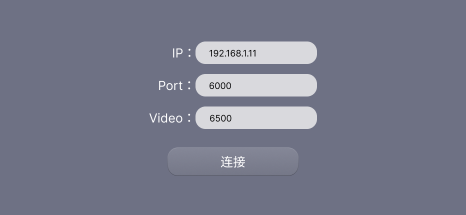
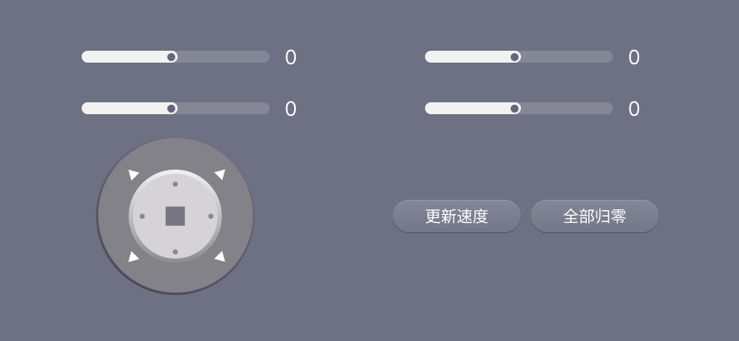
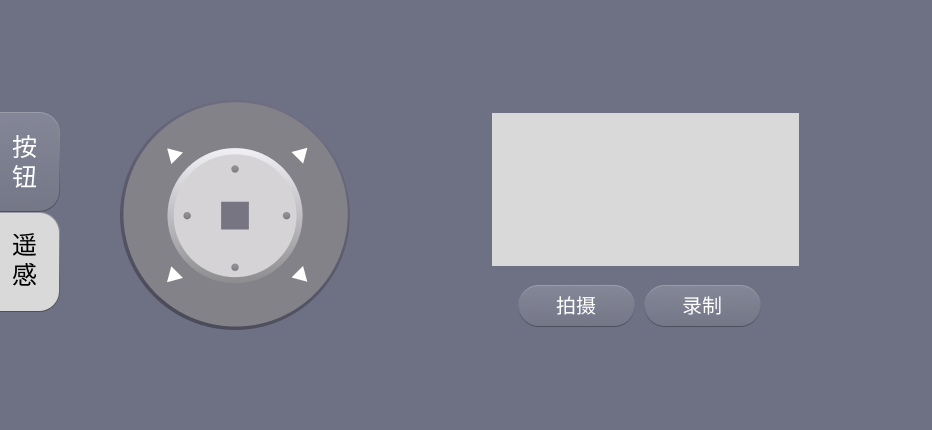

# 智慧小车 ROS 对接版本

## 测试环境

```
DevEco Studio 4.1 Release
构建版本：4.1.0.400, built on April 9, 2024
Build #DS-223.8617.56.36.410400
Runtime version: 17.0.6+10-b829.5 amd64
```

## 项目原型图

### 网络配置界面（NetworkSettings）



### 主页界面（Index）


### 麦克纳姆轮界面（MecanumWheel）



### 控制界面状态1（RemoteControl1）


### 控制界面状态2（RemoteControl2）



## ROS API

与 Ros 对接的API看
[Ros_api](./doc/ros_api.md)

## 双车联控

本项目支持**主车编排层**双车同步控制：

- 手机只连接**主车**（TCP 6000）
- 主车收到指令后本地执行，并转发给**从车**（RELAY 端口默认 6001）
- 从车离线时自动降级为**主车单控**，主车控制不中断

### 车端（car/）

| 端口 | 用途 |
|------|------|
| **6000** | 手机 → 主车，**现有 ROS 监听**（不改） |
| **6001** | 主车 → 从车车际 TCP |

主车在 ROS 收完手机指令并执行后，经 **6001** 转发从车。集成见 [car/ros_integration.md](./car/ros_integration.md)。

**从零部署全流程：[doc/双车部署操作全流程.md](./doc/双车部署操作全流程.md)**

### 手机 App 配置

1. 网络设置页填写**主车 IP** 和端口
2. 开启「双车模式」，填写**从车 IP** 和 RELAY 端口
3. 连接后 App 向主车发送 `@CONFIG{...}#`
4. 控制页顶部显示双车同步状态

## HTTP API

本项目只使用了一个http 接口，访问,相应的接口可以获取直播画面

## 文件结构

```
SmartCar
├─ 📁AppScope                                   
│  ├─ 📁resources
│  │  └─ 📁base                 
│  │     ├─ 📁element
│  │     │  └─ 📄string.json
│  │     └─ 📁media
│  │        └─ 📄app_icon.png
│  └─ 📄app.json5
├─ 📁doc                                    # 文档目录
│  ├─ 📁prototype                           # 原型图目录
│  │  ├─ 📄Index.png
│  │  ├─ 📄MecanumWheel.png
│  │  ├─ 📄NetworkSettings.png
│  │  ├─ 📄RemoteControl1.png
│  │  └─ 📄RemoteControl2.png 
│  ├─ 📄ros_api.md                          # ROS API 文档
│  └─ 📄双车部署操作全流程.md                # 双车从零部署步骤
├─ 📁car                                    # 车端双车编排（Python）
│  ├─ 📄ros_bridge.py                       # 有 ROS 时嵌入 6000
│  ├─ 📄master_phone_server.py              # 无 ROS 时主车 6000 服务
│  ├─ 📄orchestrator.py                     # 6001 转发 + @STATUS
│  ├─ 📄slave_gateway.py                    # 从车监听 6001
│  ├─ 📄protocol.py
│  ├─ 📄ros_integration.md
│  ├─ 📄command_executor.py
│  ├─ 📄config_master.json
│  ├─ 📄config_slave.json
│  └─ 📄README.md
├─ 📁entry
│  ├─ 📁src
│  │  ├─ 📁main
│  │  │  ├─ 📁ets
│  │  │  │  ├─ 📁CarUtill                   # 小车通信工具包                  
│  │  │  │  │  ├─ 📄CarApi.ets              # 小车通信API 
│  │  │  │  │  ├─ 📄CarEncode.ets           # 小车通信编码工具  
│  │  │  │  │  └─ 📄CarEnum.ets             # 小车通信状态枚举
│  │  │  │  ├─ 📁components                 # 组件包
│  │  │  │  │  ├─ 📄CarBtnComponents.ets    # 小车按钮组件
│  │  │  │  │  ├─ 📄CarRockerComponents.ets # 小车摇杆组件
│  │  │  │  │  ├─ 📄DualCarStatusBar.ets    # 双车状态条
│  │  │  │  │  └─ 📄VideoComponents.ets     # 视频组件
│  │  │  │  ├─ 📁entryability               # 入口Ability
│  │  │  │  │  └─ 📄EntryAbility.ets        # 入口Ability
│  │  │  │  ├─ 📁img                        # 图片资源
│  │  │  │  │  ├─ 📄remote.svg              # 摇杆控制图
│  │  │  │  │  └─ 📄remote_background.svg   # 摇杆控制背景图
│  │  │  │  ├─ 📁pages                      # 页面包
│  │  │  │  │  ├─ 📄Index.ets               # 主页
│  │  │  │  │  ├─ 📄MecanumWheel.ets        # 麦克纳姆轮页
│  │  │  │  │  ├─ 📄NetworkSettings.ets     # 网络配置页
│  │  │  │  │  └─ 📄RemoteControl.ets       # 遥控页
│  │  │  │  ├─ 📁styles                     # 样式包
│  │  │  │  │  └─ 📄styles.ets              # 样式
│  │  │  │  ├─ 📁tcp                        # TCP 通信包
│  │  │  │  │  ├─ 📄TCPClientManager.ets        # TCP 客户端管理
│  │  │  │  │  ├─ 📄DualCarStatusManager.ets    # 双车状态管理
│  │  │  │  │  ├─ 📄TCPClientReceiveUtils.ets   # TCP 客户端接收工具
│  │  │  │  │  └─ 📄TCPClientSendUtils.ets      # TCP 客户端发送工具
│  │  │  │  └─ 📁utils                      # 工具包
│  │  │  │     ├─ 📄MyUtils.ets             # 工具包
│  │  │  │     ├─ 📄PreferencesUtils.ets    # 偏好设置工具
│  │  │  │     └─ 📄ScreenUtils.ets         # 屏幕工具
│  │  │  ├─ 📁resources
│  │  │  │  ├─ 📁base
│  │  │  │  │  ├─ 📁element
│  │  │  │  │  │  ├─ 📄color.json            # 颜色
│  │  │  │  │  │  ├─ 📄font_color.json       # 字体颜色
│  │  │  │  │  │  ├─ 📄font_size_.json       # 字体大小
│  │  │  │  │  │  ├─ 📄radius_size.json      # 圆角大小
│  │  │  │  │  │  └─ 📄string.json           # 字符串
│  │  │  │  │  └─ 📁profile
│  │  │  │  │     └─ 📄main_pages.json       # 页面配置
├─ 📁Rocker
│  ├─ 📁src
│  │  └─ 📁main
│  │     ├─ 📁ets
│  │     │  └─ 📁components
│  │     │     ├─ 📁RockerUtils                 # 摇杆工具包
│  │     │     │  ├─ 📄RockerDrawUtils.ets      # 摇杆绘制工具
│  │     │     │  └─ 📄RockerOptions.ets        # 摇杆选项
│  │     │     ├─ 📁utils                       # 工具包
│  │     │     │  └─ 📄MathUtils.ets            # 数学工具
│  │     │     └─ 📄RockerComponent.ets         # 摇杆组件
│  ├─ 📄Index.ets                               # 入口文件
│  └─ 📄oh-package.json5                        # 包配置
├─ 📄.gitignore
├─ 📄build-profile.json5
├─ 📄hvigorfile.ts
├─ 📄hvigorw
├─ 📄hvigorw.bat
├─ 📄oh-package-lock.json5
├─ 📄oh-package.json5
└─ 📄readme.md
```